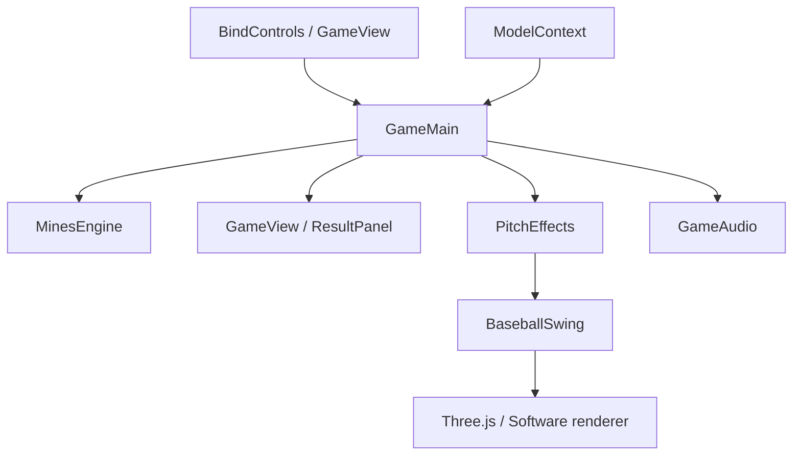

# 현재 프로젝트 구조

## 현재 작업 범위 — 2026-09-17 최신 결정

템플릿 시작 조건이 준비될 때까지 **현재 HTML·JavaScript POC 개발과 ZIP 배포에 집중한다.** 같은 날의 UI 전면 전환 지시는 사용자의 최신 결정으로 보류되었다. POC UI는 현재 방식으로 수정·검증하며, `doc/skills`는 향후 PixiBrown 이식 기준으로 유지한다. 현재 POC를 SKILLS 준수 구현으로 표시하지 않는다. 작업 규칙은 루트 `AGENTS.md`에 기록했다.


## 적용 범위

2026-09-15 정리. 현재 실행물은 **HTML·JavaScript POC v12.2**다. PixiBrown 템플릿 포크는 아직 없으며, SceneMaker에서 열 수 있는 prefab 프로젝트로 변환된 상태가 아니다.

`skills/client.md`의 역할 분리, `skills/scene-structure.md`의 계층 분리, `skills/assets.md`의 원본/산출물 구분을 현재 POC에 적용했다. 실제 PixiBrown 전환 규칙은 [이식 문서](pixibrown-migration.md)에 모았다. 기존 HTML UI는 POC 비교 기준으로 보존한다.

## 디렉터리

```text
Baseball/
├── poc/                         # 현재 POC 편집 원본
│   ├── index.html               # 기존 화면 골격; dist를 기준으로 한 상대 URL
│   ├── build-manifest.json      # 복사 대상 + 브라우저 코드 결합 순서
│   ├── styles/game.css          # 기존 화면 스타일·레이어·반응형 수치
│   ├── src/
│   │   ├── domain/mines-engine.js  # 난수, 보드, 배당, 크레딧 정산
│   │   ├── game/
│   │   │   ├── game-main.js     # 라운드 진행과 자식 기능 조율
│   │   │   ├── shared/format.js # 크레딧·배율 표시 형식
│   │   │   ├── ui/
│   │   │   │   ├── game-view.js    # 보드·HUD 표시와 입력값 읽기
│   │   │   │   ├── bind-controls.js # 버튼·설정 이벤트 연결
│   │   │   │   └── result-panel.js  # 결과 팝업 표시
│   │   │   ├── audio/game-audio.js  # 음소거 상태와 기존 효과음
│   │   │   └── fx/
│   │   │       ├── pitch-effects.js # 투수·공·타격 피드백
│   │   │       └── baseball-swing.js # 3D/소프트웨어 배트 렌더러
│   │   └── integration/model-context.js # 브라우저 도구 연결
│   ├── assets/
│   │   ├── images/              # POC 이미지 원본
│   │   └── legacy/              # 과거 버전 손 메시; 현재 화면에서 미사용
│   └── vendor/                 # 고정 Three.js와 라이선스
├── source-assets/               # 받은 제작 원본(GLB, 미연결 MP3)
├── dist/                        # 빌드 산출물; 로컬/오프라인/기존 호스팅 경로
├── tools/                       # POC 빌드·정적 서버·검증·과거 에셋 변환
├── tests/                       # 룰/정산·정적 서버 회귀 검사
├── doc/
│   ├── skills/                  # 받은 PixiBrown 개발 문서 원본
│   ├── history/                 # v12.2까지의 상세 작업 기록과 과거 프롬프트
│   ├── project-structure.md     # 이 문서
│   └── pixibrown-migration.md   # 목표 구조, 씬 역할, 미충족 조건
├── package.json                 # 외부 패키지 설치 없는 실행 명령
├── server.cjs                   # 이전 실행 명령 호환 진입점
├── README.md                    # 실행·수정 안내
└── THIRD-PARTY.md               # 외부 라이브러리/모델 출처
```

`.work/`는 로컬 검증 파일과 변경 전 비교본이며 Git에서 제외한다. 기존 `doc/skills`, 공통 디자인 가이드, `source-assets`의 받은 원본은 유지했다.

## 코드 의존성



- Main이 게임 상태 변경과 입력 잠금, 연출 순서를 조율한다. POC의 다단계 타격 루프를 유지했다.
- 표시 객체는 `game`, `surface`, `isBusy`, 콜백을 생성 시 주입받는다. 결과 창은 라운드 번호를 getter로 받는다.
- UI 간 직접 호출 대신 Main이 갱신한다. DOM 조회·반복 버튼 생성은 기존 POC의 구현이며 PixiBrown 이식 시 prefab/Serialize로 교체할 대상이다.
- 팩토리 함수와 공용 포맷 함수는 빌드 때 하나의 IIFE 내부에 결합된다. ES modules나 npm 번들러가 아니므로 `dist/index.html` 직접 열기도 유지한다. 추가 파일은 manifest의 `scripts` 순서에 등록한다.
- `MinesEngine`, `BaseballSwing`, `THREE`는 기존 classic-script 연결을 유지한다. 게임 상태와 Main 변수는 번들 내부에 감싼다.

## 수정 → 확인

1. 위 표의 `poc/` 원본을 수정한다. `dist/` 수정 내용은 다음 빌드에서 덮어써진다.
2. `npm run build`로 원본을 `dist`에 반영한다.
3. `npm run check`로 소스/산출물 일치와 문법을 검사하고 `npm test`로 룰·서버를 확인한다.
4. `npm start` 후 `http://127.0.0.1:4173/`에서 확인한다. 시작할 때도 자동 빌드한다.
5. 서버가 이미 실행 중이면 `npm run build` 후 브라우저를 새로고침한다. 파일 감시/HMR은 없다.

현재 `dist`는 기존 저장소 방식을 유지해 Git에 추적한다. 배포 설정도 `dist`를 가리킨다. 새 호스팅 배포는 이번 정리에 포함하지 않았다.

`tools/dev-server.cjs`는 정적 파일 서버다. 베팅 응답을 만드는 PixiBrown `src/network/local_server`와 역할이 다르다. 현재 가상 크레딧·난수·위험 코스 상태는 브라우저 엔진에 있다.

## 에셋 책임

| 위치 | 용도 | 현재 연결 |
|---|---|---|
| `poc/assets/images/stadium-clean.png` | 현재 경기장 배경 | CSS |
| `poc/assets/images/pitcher-sprites.png` | 투수 프레임 시트 | CSS/투구 연출 |
| `poc/assets/images/stadium-background.png` | 이전 배경 및 기존 CSS 참조 | 보존 |
| `poc/assets/images/bat.png` | 과거 배트 이미지 | 현재 3D 배트에서 미사용 |
| `poc/assets/legacy/batting-hands.js` | 과거 v6 손 메시 | 현재 페이지에서 미로드 |
| `source-assets/hands/*.glb` | 손 메시 제작 원본 | 과거 변환 도구 입력 |
| `source-assets/sounds/baseball_bg.mp3` | 받은 사운드 원본 | 현재 미연결 |

과거 이미지 생성 프롬프트는 `doc/history/asset-prompts-v3.json`에 기록으로만 보관한다. 새 아트 제작 기준은 `doc/skills/SKILL.md`의 이미지 생성 금지와 작업자 제공 이미지 규칙이다.
